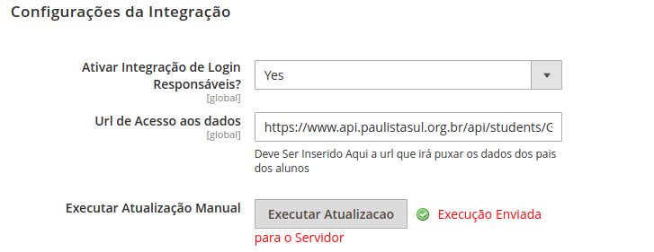

# Modelo de pacote Bleez

Repositório com modelo de pacote para desenvolvimentos de pacotes Bleez.

Esse modelo já tem:

* Pasta dedicada ao código do pacote
* Pasta dedicada ao código de testes unitários
* Arquivos para uso do composer
* Arquivos para registro do módulo no Magento
* Arquivos iniciais para configurar CI no CircleCI

## Padrão de nome

Estamos usando como nome do pacote o mesmo padrão do Magento e usando o prefixo  `module-`.

Se você for, por exemplo, fazer um módulo que se integra com a Cielo crie seu modulo como `module-cielo`.

## O que você deve mudar ANTES de começar

Uma vez que você criar seu projeto usando este pacote como template você não pode se esquecer de alterar os seguintes arquivos.

### registration.php

Uma vez que o mesmo for instalado pelo composer, este arquivo registra o pacote no Magento como um módulo.

```php
<?php

\Magento\Framework\Component\ComponentRegistrar::register(
    \Magento\Framework\Component\ComponentRegistrar::MODULE, <-- mude aqui caso seu pacote não seja um módulo, mas sim um tema ou uma tradução
    'Bleez_Modelo', <---- altere aqui
    __DIR__ . '/src'
);
```

Esse é o "código" que seu pacote terá no Magento. Você irá usá-lo para habilitar/desabilitar e outras coisas.

### composer.json

Este arquivo é o que registra seu pacote para ser instalavel pelo Magento. A função principal dele é setar os namespaces e as dependências (outros pacotes que você usa e que se não tiverem instalados seu pacote não funciona).

#### Seção `name`

Na seção `name` é onde você informa qual o nome do pacote. Esse é o nome que será informado no `composer.json` próprio Magento para que o pacote seja instalado.

```json

    ...

    "name": "bleez/module-modelo",

    ...
```

#### Seção `require`

A seção `require` é onde colocamos todas as dependencias dos nossos módulos.

```json
    ...

    "require": {
        "php": "^7.2.0",
        "magento/product-community-edition": "^2.3"
    }

    ...
```

Atualmente trabalhamos como padrão a versão 7.2 do PHP e a 2.3 do Magento. É importante manter essa informação.

Caso seu pacote dependa de algum outro pacote você deve informar aqui. Por exemplo, o [Bleez Correios](https://github.com/Bleez/module-correios-adapter) depende do [Bleez Shippings](https://github.com/Bleez/module-shippings) e do [PHP Correios](https://github.com/brunoviana/php-correios), potanto seu `composer.json` tem essa informação:

```json
    ...

    "require": {
        "php": "^7.2.0",
        "magento/product-community-edition": "^2.3",
        "brunoviana/php-correios": "^1.0",
        "bleez/module-shippings": "~1.0"
    }

    ...
```

Se você não sabe se deve usar `~` ou `^` nas suas versões consulte a [documentação do Composer onde ele fala sobre Version Constraints](https://getcomposer.org/doc/articles/versions.md#writing-version-constraints).

#### Seção `autoload`

Nessa seção, dentro da sub-seção `psr-4`, você irá registrar os namespaces do seu pacote para o composer fazer os devidos *requires* bonitinho.

```json
    ...

    "autoload": {
        "files": [
            "registration.php"
        ],
        "psr-4": {
            "Bleez\\Modelo\\": "src/",
            "Bleez\\Modelo\\Test\\": "tests/"
        }
    },

    ...
```

### /etc/module.xml

Este arquivo também ajuda a definir o seu pacote como um módulo do Magento e define qual a versão dele **dentro do Magento**. Essa versão pode ser diferente da versão do seu pacote no Github.

```xml
<?xml version="1.0"?>
<config xmlns:xsi="http://www.w3.org/2001/XMLSchema-instance" 
        xsi:noNamespaceSchemaLocation="urn:magento:framework:Module/etc/module.xsd">

    <module name="Bleez_Modelo" setup_version="0.0.1"></module>

</config>
```

Mude `name` para o código usado em `registrarion.php`.

## O que mudar DEPOIS que começar

Uma vez que **a primeira funcionalidade do módulo** estiver pronta você precisa alterar alguns aquivos.

### README.md

Altere o `README.md` com a documentação do seu pacote.

Lembre-se daqui a 6 meses você não vai lembrar de mais nada. Da mesma forma evite que as pessoas fiquem te fazendo as mesmas perguntas idiotas. Mantendo tudo documentado você garante menos preenchimento de saco.

Use como modelo o [Bleez Correios](https://github.com/Bleez/module-correios-adapter) e o [Bleez Shippings](https://github.com/Bleez/module-shippings) para escrever uma documentação útil.

### CHANGELOG.md

Sempre documente o que está alterando, assim facilitar a vida de quem vai testar, de quem vai revisar o código e de quem vai usar o pacote, além de ter menos gente de aporrrinhando.

Leia o [Keep a Changelog](https://keepachangelog.com/pt-BR/1.0.0/) que é o padrão de Changelog que estamos usando nos pacotes.

#### Importante

Não seja um cuzão. Documente esta porra que você tá criando.

## Considerações finais

Aconselho fortemente usar o nosso [Ambiente de Desenvolvimento](https://github.com/Bleez/docker-dev-magento) em conjunto do nosso [Magento para desenvolvimento de pacotes](https://github.com/Bleez/magento-dev-pacotes).

Eles te darão de forma mastigada ferramentas para desenvolver pacotes.

# Documentação

## Configuração

- Para configurar o módulo e ativa-lo, devemos ir em Lojas -> Configurações -> Customer -> Customer Configuration e irmos 
até a aba de Configuração integração.

Está aba possuí 3 opções

* Ativar ou Desativar Integração
* Colocar Url de Acesso da Api
* Botão de Executar Integração Manual



## Funcionamento da Integração

- O arquivo que rodá a integração está em /Console/Command/AtualizarTabelaLogin. Os dados que são retornados da API
é um array com as informações dos usuários.

Essa atualização consiste em 4 partes

1 - Verificar se a configuração a Integração está ativa, deverá rodar somente se a opção configurada na administração 
estiver como sim. Ela puxa a configuração da administração do magento.

```php
private function getIntegracaoAtiva()
{
  return $this->scopeConfig->getValue(self::INTEGRACAO_ATIVA);
}
```

2 - Puxar os dados da Api da Central do Aluno

```php
private function getJson()
    {
        $curl = curl_init();

        curl_setopt_array($curl, array(
            CURLOPT_URL => $this->getUrlIntegracao(),
            CURLOPT_RETURNTRANSFER => true,
            CURLOPT_ENCODING => "",
            CURLOPT_MAXREDIRS => 10,
            CURLOPT_TIMEOUT => 0,
            CURLOPT_FOLLOWLOCATION => false,
            CURLOPT_HTTP_VERSION => CURL_HTTP_VERSION_1_1,
            CURLOPT_CUSTOMREQUEST => "GET",
            CURLOPT_SSL_VERIFYHOST => 0
        ));

        $response = curl_exec($curl);
        $err = curl_error($curl);

        curl_close($curl);

        if ($err) {
            return $err;
        }

        return json_decode($response, true);
    }
```

3 - Após pegar os dados, é feita uma verificação para saber se aquele responsável já não está cadastrado na base
de dados do Magento. Para saber se esse aluno já existe é filtrado pelo codigo do aluno e codigo da escola, caso 
retorne algum tipo de informação signifa que a informação já está cadastrada no magento.

```php
private function verificarSeUsuarioExiste(array $dado)
    {
        $centralAlunoLogin = $this->centralAlunoLoginFactory->create();
        $dados = $centralAlunoLogin->getCollection()
            ->addFieldToFilter('cod_aluno', $dado['cod_aluno'])
            ->addFieldToFilter('cod_escola', $dado['cod_escola'])
            ->load();

        if ($dados->getFirstItem()->getData()){
            return $dados;
        }

        return null;
    }
```

4 - Após a verificação é feito duas escolhas, ou atualizar os dados caso retorne algo da consulta ou criar um novo
registro na tabela.

```php
private function adicionarDados (array $dado)
    {
        $centralAlunoLogin = $this->centralAlunoLoginFactory->create();
        $centralAlunoLogin->addData($dado);
        $centralAlunoLogin->save();
    }

private function atualizarDados($consulta, array $dado)
    {
        $consulta->getFirstItem()->addData($dado)->save();
    }
```
## Verificação do Login

- Para resolver o problema do Login, onde o usuário só deverá logar caso o usuário esteja cadastrado na base de dados
foi feito um Plugin. Esse Plugin se encontra em /Plugin/BeforeLoginPluing.php

- Para esse plugin ser ativo, é criado uma configuração na pasta /etc/di.xml, dentro deste arquivo é instanciado a 
classe a qual eu quero observar, qual é a classe que eu vou utilizar para realizar uma ação de verificação.

```xml
<!-- Plugins -->
    <type name="Magento\Customer\Controller\Account\LoginPost">
        <plugin name="before_execute_login" type="Bleez\CentralAlunoLogin\Plugin\BeforeLoginPlugin" sortOrder="1" disabled="false"/>
    </type>
    <type name="Bleez\CentralAlunoLogin\Plugin\BeforeLoginPlugin">
        <arguments>
            <argument name="defaultTargetUrl" xsi:type="string">/</argument>
        </arguments>
    </type>
    <!-- End Plugin -->
```

- O plugin ele é executado antes de terminar a operação de Plugin, por isso o nome da função é beforeExecute, isso é um
padrão do magento. Existem 3 tipo (before, around, after) são as ações que um plugin pode fazer em uma função de uma
classe do magento. Neste caso, precisamos que ele execute a tarefa antes de completar o login.

1 - Verifica se a integração está ativa. Caso não, não é necessário fazer a validação.

```php
private function getIntegracaoAtiva()
    {
        return $this->scopeConfig->getValue(self::INTEGRACAO_ATIVA);
    }
```

2 - Próximo passo é captar o e-mail do usuário, que ele digitou no formulário de login, para poder ser utilizado
como pesquisa desse usuário na base de dados.

```php
$customerLogin = $customerAccountLoginController->getRequest()->getParams('login');
$userEmail = $customerLogin['login']['username'];
```

3 - Verificar se aquele e-mail está cadastrado ou como responsável financeiro ou como Responsável legal do aluno,
caso não esteja cadastrado é enviado um alerta para o usuário, onde o login não é autorizado.

```php
if (!$this->verificaSeExisteEmailRespFinanceiro($userEmail)) {
    throw new LocalizedException(__("Login Não autorizado"));
}

if(!$this->verificaSeExisteEmailRespLegal($userEmail)) {
    throw new LocalizedException(__("Login Não autorizado"));
}

private function verificaSeExisteEmailRespFinanceiro(string $email)
    {
        $centralAlunoLogin = $this->centralAlunoLoginFactory->create();
        $dados = $centralAlunoLogin->getCollection()->addFieldToFilter('Email_Resp_Financeiro', $email)->load();

        if ($dados->getFirstItem()->getData()){
            return $dados;
        }

        return null;
    }

    /**
     * @param string $email
     */
    private function verificaSeExisteEmailRespLegal(string $email) {
        $centralAlunoLogin = $this->centralAlunoLoginFactory->create();
        $dados = $centralAlunoLogin->getCollection()->addFieldToFilter('Email_Resp_Legal', $email)->load();

        if ($dados->getFirstItem()->getData()){
            return $dados;
        }

        return null;
    }
```
